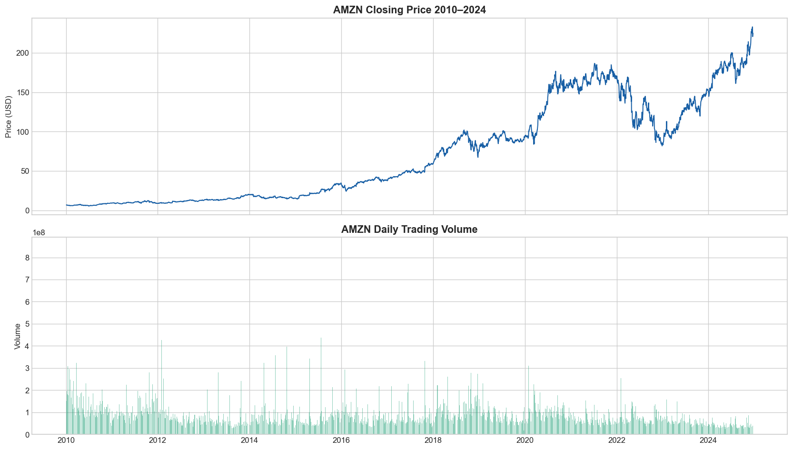
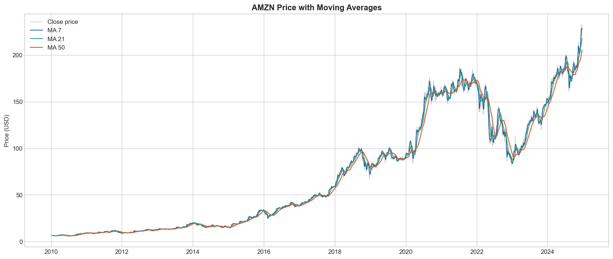
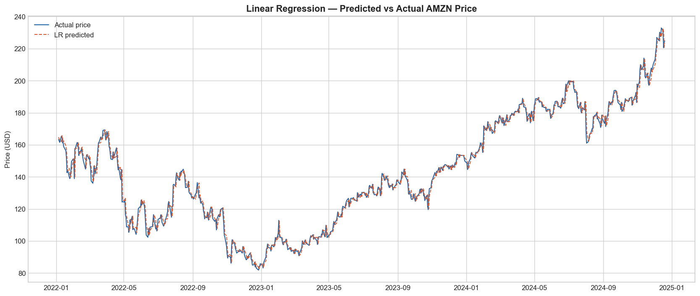
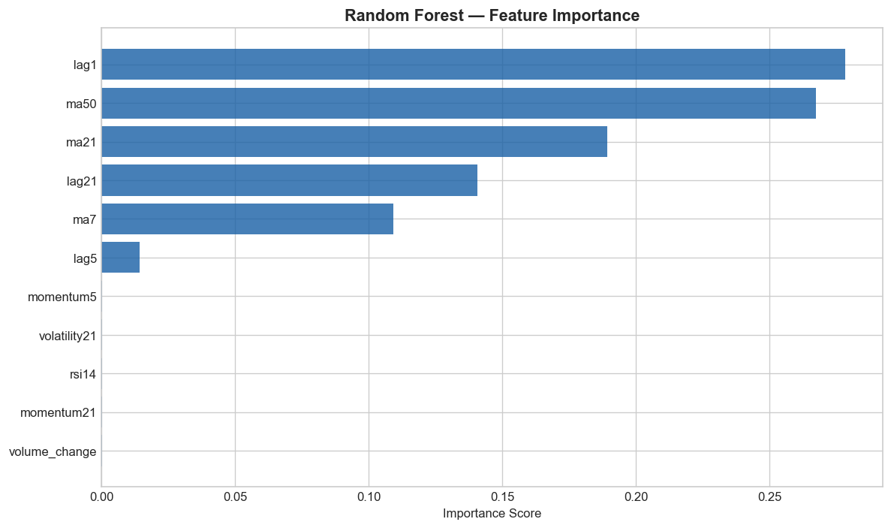

# S&P 500 Stock Price Forecasting — AMZN


## Overview
An end-to-end data science project forecasting Amazon (AMZN)
next-day closing prices using historical S&P 500 stock data.
The project covers the full pipeline from raw data through
to model evaluation and honest interpretation of results.

## Business Question
> Can technical indicators derived from historical price data
> predict next-day closing prices better than a naive baseline?

## Dataset
- **Source:** S&P 500 Stocks dataset (Kaggle)
- **Coverage:** 502 tickers, 2010–2024, ~1.9M rows
- **Focus stock:** Amazon (AMZN) — 3,768 trading days
- **Columns:** Date, Open, High, Low, Close, Adj Close, Volume

## Project Structure
```
Github-S-P-500-Companies-Forecasting/
├── data/
│   ├── sp500_stocks.csv          # Raw dataset
│   └── amzn_features.csv         # Engineered features
├── notebooks/
│   ├── 01_eda.ipynb              # Exploratory data analysis
│   ├── 02_feature_engineering.ipynb  # Feature creation
│   └── 03_modelling.ipynb        # Model training and evaluation
├── outputs/
│   ├── amzn_price_volume.png
│   ├── amzn_returns.png
│   ├── multi_stock_comparison.png
│   ├── correlation_heatmap.png
│   ├── amzn_moving_averages.png
│   ├── train_test_split.png
│   ├── lr_predictions.png
│   ├── rf_predictions.png
│   ├── feature_importance.png
│   └── model_comparison.csv
├── src/
│   └── utils.py
├── requirements.txt
└── README.md
```

## Methodology

### 1. Exploratory Data Analysis
- Cleaned 1.9M rows, dropping missing close prices
- Analysed AMZN price and volume trends 2010–2024
- Compared normalised performance across 5 stocks
- Computed return correlations across sectors

### 2. Feature Engineering
Built 11 features from raw price data — all using only
past data to avoid lookahead bias:

| Feature | Description |
|---|---|
| MA7, MA21, MA50 | Moving averages (short/medium/long trend) |
| RSI14 | Relative Strength Index — momentum signal |
| Volatility21 | 21-day rolling standard deviation of returns |
| Lag1, Lag5, Lag21 | Previous closing prices (model memory) |
| Momentum5, Momentum21 | Price change over 5 and 21 days |
| Volume change | Daily volume percentage change |

### 3. Modelling
80/20 chronological train/test split (no shuffling).
Three models trained and evaluated on RMSE:

| Model | RMSE ($) | vs Baseline |
|---|---|---|
| Naive Baseline | 3.30 | — |
| Linear Regression | 3.32 | +$0.02 worse |
| Random Forest | 12.53 | +$9.23 worse |

## Key Charts

### AMZN Price & Volume 2010–2024


### Moving Averages


### Predicted vs Actual — Linear Regression


### Feature Importance — Random Forest


## Results & Findings
Neither model outperformed the naive baseline meaningfully.
Linear Regression matched the baseline almost exactly (RMSE $3.32
vs $3.30). Random Forest overfitted severely to training data,
performing significantly worse on unseen data (RMSE $12.53).

This is a known challenge in financial ML — prices follow a
near-random walk and are highly efficient. The dominant signal
(lag1 — yesterday's price) essentially replicates the naive
strategy of predicting no change.

## Lessons Learned
- Stock prices are harder to predict than most ML textbooks suggest
- Overfitting is a real danger with tree-based models on time series
- Honest negative results are as valuable as positive ones
- A naive baseline is essential — without it, any result looks good

## Future Improvements
- Tune Random Forest hyperparameters to reduce overfitting
- Add fundamental data (P/E ratio, earnings surprises)
- Predict price direction (up/down) instead of exact price
- Use walk-forward validation for more robust evaluation
- Try LSTM or other time-series specific architectures

## Setup
```bash
git clone https://github.com/loreroma265-max/Github-S-P-500-Companies-Forecasting.git
cd Github-S-P-500-Companies-Forecasting
python -m venv venv
venv\Scripts\activate
pip install -r requirements.txt
jupyter notebook
```

## Author
Lorenzo Roma — [GitHub](https://github.com/loreroma265-max)